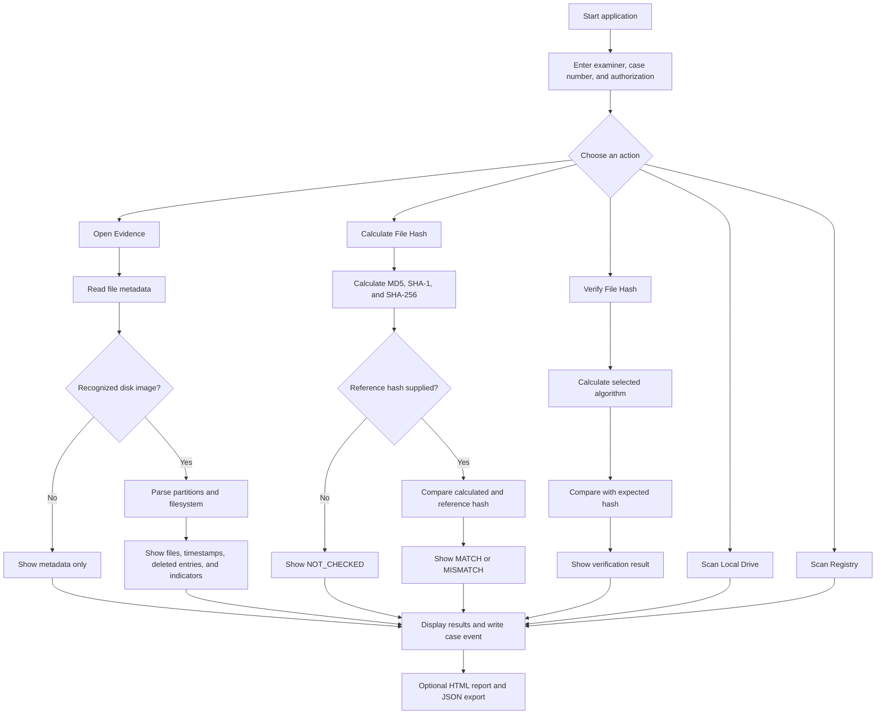

# Computer Forensics Analysis Tool

A Windows desktop tool for basic, read-only forensic triage of files, disk images, local drives, and selected Windows Registry information.

This tool is intended to support an authorized examination. It is not a replacement for a validated forensic suite or formal examiner review.

## Tool Overview

The application is a small Windows forensic triage tool with a Tkinter interface. It separates the user interface from the forensic processing code:

- `forensic_tool.py` displays windows, buttons, progress dialogs, results, and reports.
- `forensic_backend.py` reads metadata, parses disk images, calculates hashes, scans drives and the Registry, and records chain-of-custody events.
- `pytsk3` provides filesystem and partition parsing through The Sleuth Kit.
- `libewf-python` provides access to EnCase/EWF image formats such as `.E01`.

The tool is read-only with respect to the selected evidence. It reads information, calculates results in memory, and writes analysis output, logs, or reports separately.

## How It Works



### Simple processing sequence

1. The examiner starts a case session by entering an examiner name and case number.
2. The tool asks for authorization confirmation before collection begins.
3. The examiner selects an action and evidence source.
4. Long-running work runs in the background so the interface remains responsive and cancellable.
5. The backend returns structured results to the interface.
6. The action is written to the chain-of-custody log.
7. The examiner reviews the output and may export a report.

## Understanding Open Evidence

**Open Evidence** is the general file inspection workflow. It accepts any regular file.

For an ordinary file, it displays:

- File name and full path
- Extension and detected MIME type
- File size
- Created, modified, and accessed timestamps

It does not calculate hashes automatically.

For a supported disk image, it additionally attempts to identify partitions and parse the filesystem. The results can include:

- Partition information
- Filesystem type
- File and directory paths
- File sizes and MACB-style timestamps
- Deleted or unallocated entries
- File-extension/content signature mismatches

An image that cannot be parsed is not treated as a successful filesystem analysis. The result should be reviewed for an explicit filesystem error.

## Understanding Hash Integrity

A hash is a fixed-length value calculated from a file's bytes. Changing even a small part of the file normally changes its hash.

The tool supports three separate outcomes in **Calculate File Hash**:

| Result | Meaning |
|---|---|
| `MATCH` | The calculated hash equals the supplied reference or acquisition hash. |
| `MISMATCH` | The calculated hash differs from the supplied reference hash. The file is not identical to that reference. |
| `NOT_CHECKED` | No reference hash was supplied, so the tool calculated hashes but did not make an integrity comparison. |

Example:

```text
SHA-256: 8d...f2
SHA-1:   1a...90
MD5:     7b...44
Integrity: MATCH (SHA256)
```

`MATCH` means the bytes match the reference hash. It does not by itself prove who created the file, whether the file is safe, or whether the reference hash came from a trustworthy acquisition process.

**Verify File Hash** is the focused comparison workflow. It asks for one expected hash, detects whether it is MD5, SHA-1, or SHA-256 from its length, calculates the same algorithm, and reports `MATCH` or `MISMATCH`.

## What the Main Results Mean

- **Deleted entry:** A filesystem record marked unallocated. The content may be partially overwritten or unavailable; it is not automatically recovered.
- **Signature mismatch:** The file content does not begin with the expected magic bytes for its extension. This is an indicator for review, not proof of concealment or malicious intent.
- **Filesystem parsed:** The image was opened and at least one filesystem was enumerated.
- **Filesystem error:** The tool could not parse a filesystem. Possible causes include encryption, corruption, unsupported formats, or selecting a non-image file.
- **Chain-of-custody event:** A timestamped record of an action taken during the case session.

## Features

- **Open Evidence**
  - Select any regular file.
  - Display file name, path, extension, MIME type, size, and timestamps.
  - Parse supported disk images such as `.E01`, `.EX01`, `.S01`, `.L01`, `.dd`, `.img`, and `.raw`.
  - List partitions, filesystem entries, timestamps, deleted entries, and possible extension/content mismatches.
  - Does not calculate hashes during the normal Open Evidence workflow.

- **Verify File Hash**
  - Separately verify a supplied MD5, SHA-1, or SHA-256 value.
  - Hashing occurs only after the examiner chooses this action and provides a reference hash.

- **Calculate File Hash**
  - Calculate and display MD5, SHA-1, and SHA-256 for a selected file.
  - Optionally compare a supplied acquisition/reference hash and show `MATCH`, `MISMATCH`, or `NOT_CHECKED`.
  - This is an explicit action and is separate from Open Evidence metadata collection.

- **Scan Local Drive(s)**
  - Collect filesystem, capacity, file-count, and extension statistics for logical drives.

- **Scan Registry**
  - Collect selected information from the live Windows Registry, including system details, desktop settings, and installed software.

- **Export Report**
  - Export collected results and the session chain-of-custody log as an HTML report.

- **Chain of custody**
  - Record examiner, case number, selected actions, timestamps, and report activity in a local JSON log.

## Requirements

- Windows
- Python 3.11 or newer recommended
- Python packages listed in `requirements.txt`:
  - `pytsk3`
  - `libewf-python`

## Installation

Open PowerShell in this project directory and create a virtual environment:

```powershell
python -m venv .venv
.\.venv\Scripts\Activate.ps1
python -m pip install --upgrade pip
python -m pip install -r requirements.txt
```

If PowerShell blocks script activation, run the application with the virtual-environment interpreter directly:

```powershell
.\.venv\Scripts\python.exe forensic_tool.py
```

## Running the tool

With the virtual environment activated:

```powershell
python forensic_tool.py
```

The application first asks for an examiner name, case number, and authorization confirmation. Complete that step before collecting evidence information.

## Typical workflow

1. Use a forensic working copy or a verified forensic image. Do not work on the original evidence.
2. Start the application and enter the case information.
3. Use **Open Evidence** to select a file or disk image.
4. Review the displayed metadata and, for disk images, the filesystem results.
5. Use **Calculate File Hash** when you need the file's current hash values or a reference-hash integrity check.
6. Use **Verify File Hash** when an acquisition or reference hash is available.
7. Export an HTML report after reviewing the results.
8. Preserve the evidence, exported report, JSON files, and chain-of-custody log together.

## Evidence and accuracy notes

- Open Evidence reads selected files and does not modify their contents.
- Open Evidence does not hash selected files automatically. Hashes are produced only by **Calculate File Hash**, **Verify File Hash**, or split-image integrity checks in the backend.
- A `MATCH` means the calculated hash equals the supplied reference hash. `MISMATCH` means the bytes differ. `NOT_CHECKED` means no reference hash was supplied.
- Disk-image parsing depends on the capabilities of The Sleuth Kit (`pytsk3`) and `libewf-python`.
- A filesystem entry marked deleted may not be recoverable. It is an investigative lead, not proof that the original content still exists.
- Extension/content mismatches are indicators for review, not conclusions about user intent or malware.
- Timestamps can have filesystem, timezone, and operating-system interpretation differences. Treat them as forensic data requiring context.
- Registry scanning reads the live host Registry. It does not automatically parse an offline Windows Registry hive from an evidence image.
- Results are bounded by the configured file enumeration limit and by filesystem corruption, encryption, unsupported filesystems, or damaged evidence.
- The tool does not perform file carving, malware classification, timeline correlation, or full deleted-file recovery.

## Forensic handling and ethics

Only examine systems, files, and images for which you have explicit authorization. Document the authority, examiner, case number, evidence source, acquisition details, and all transfers or transformations.

Recommended safeguards:

- Preserve the original evidence as read-only.
- Use verified working copies for analysis.
- Record acquisition and verification hashes separately when required by your procedure. The tool does not create an acquisition hash automatically during Open Evidence.
- Keep exported reports and chain-of-custody logs with the case materials.
- Do not treat automated findings as final conclusions without examiner review.
- Protect reports and logs because they may contain personal, confidential, or security-sensitive information.

## Project files

- `forensic_tool.py` - Tkinter graphical interface and background job handling.
- `forensic_backend.py` - metadata collection, image parsing, optional hash verification, drive and Registry analysis, and report generation.
- `requirements.txt` - Python dependencies.
- `2011-10-19-Sample.E01` - sample evidence image, if present in the workspace.

## Troubleshooting

### E01 support error

Install the dependencies in the active environment:

```powershell
python -m pip install -r requirements.txt
```

Confirm that both packages can be imported:

```powershell
python -c "import pytsk3, pyewf; print('Forensic dependencies available')"
```

### The application shows no filesystem entries

The selected file may not be a disk image, may use an unsupported filesystem, or may be encrypted or damaged. The tool should still show ordinary file metadata when the selected path is a regular file.

### Reports or logs contain sensitive information

Store them in the case directory with appropriate access controls. The application writes debug and chain-of-custody logs below the user's `ForensicToolLogs` directory by default.
